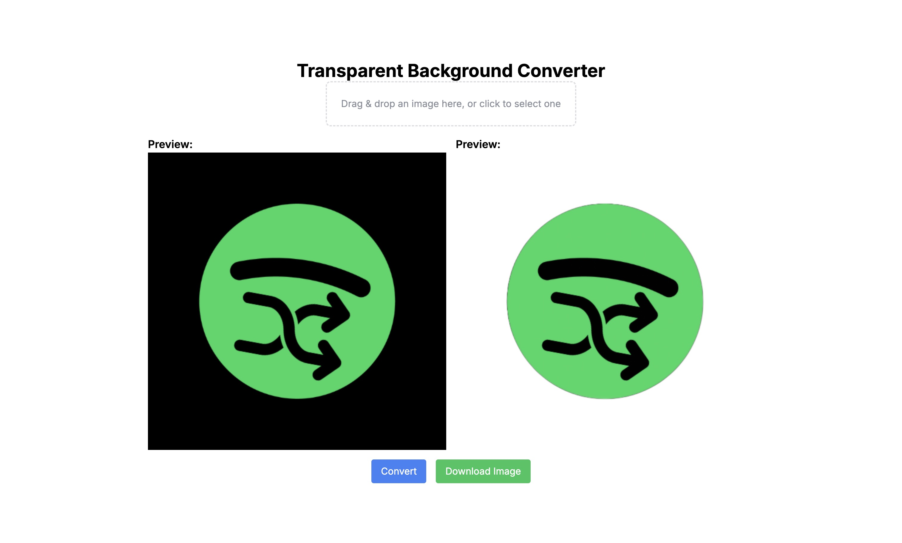
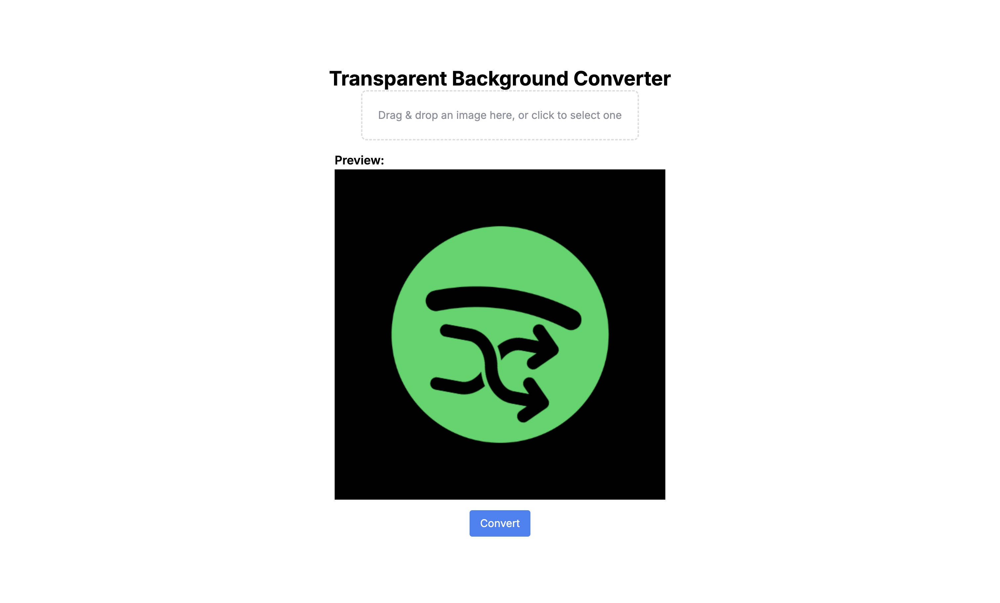

# 🌟 Transparent Background Converter

Welcome to the **Transparent Background Converter**! This web application allows you to easily remove backgrounds from images and download the result, all in your browser. Built with Next.js, TailwindCSS, TypeScript, and Framer Motion, this tool is designed to be user-friendly and efficient. 🚀



## ✨ Features

- **Drag-and-Drop or File Upload**: Upload images via drag-and-drop or by selecting files from your device. 🖼️
- **Background Removal**: Automatically remove the background from your images. 🏞️
- **Preview**: View the image with the background removed before downloading. 👁️
- **Download**: Save the processed image to your device with a transparent background. ⬇️

## 🚀 Getting Started

### Prerequisites

- Node.js and npm installed on your machine. 🔧

### Installation

1. **Clone the Repository**

   ```bash
   git clone https://github.com/your-username/transparent-background-converter.git
   cd transparent-background-converter
   ```

2. **Install Dependencies**

   ```bash
   npm install
   ```

3. **Run the Development Server**

   ```bash
   npm run dev
   ```

   Open your browser and navigate to `http://localhost:3000` to use the tool. 🌐

## 🛠️ Usage

1. **Upload an Image**

   Drag and drop an image into the designated area or click to select an image file. 📤

    <!-- Add an actual image of the upload feature -->

2. **Convert the Image**

   Click the "Convert" button to process the image and remove the background. 🔄

    <!-- Add an actual image of the convert button -->

3. **Preview and Download**

   Once the background is removed, preview the result and click the "Download Image" button to save it. 📥

    <!-- Add an actual image of the preview and download buttons -->

## 🛠️ Technology Stack

- **Next.js**: React framework for server-side rendering and static site generation. 
- **TailwindCSS**: Utility-first CSS framework for styling. 
- **TypeScript**: Typed superset of JavaScript for better development experience. 
- **Framer Motion**: Animation library for React. 
- **@imgly/background-removal**: Package for removing image backgrounds. 

## 🌟 Future Features

We're excited to bring you even more features in the future, including:

- **Basic Image Editor**: 
  - Rounding image edges 🔄
  - Resizing images 📏
  - Compressing images 📉
  - Converting images to different file formats 🖼️
  - Adding text to images ✍️
  - Overlaying images with other images 🖼️+🖼️

## 🤝 Contributing

If you'd like to contribute to this project, please follow these steps:

1. Fork the repository. 🍴
2. Create a new branch (`git checkout -b feature/YourFeature`). 🌿
3. Commit your changes (`git commit -am 'Add new feature'`). 📝
4. Push to the branch (`git push origin feature/YourFeature`). ⬆️
5. Create a new Pull Request. 🔀

## 📜 License

This project is licensed under the MIT License - see the [LICENSE](./LICENSE) file for details.

## 🙏 Acknowledgments

- Thanks to the creators of the `@imgly/background-removal` package for their excellent work. 🎉
- Special thanks to the Next.js and TailwindCSS communities for their support and documentation. 🙌
